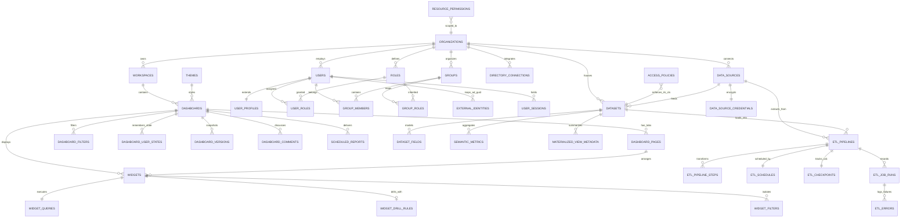
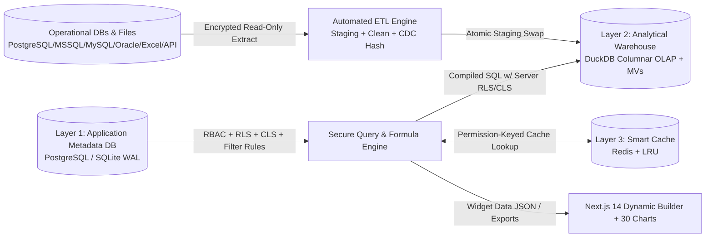

# Deliverable 03 — Entity Relationship Diagram (ERD)

```mermaid
erDiagram
    ORGANIZATIONS ||--o{ USERS : employs
    ORGANIZATIONS ||--o{ ROLES : defines
    ORGANIZATIONS ||--o{ GROUPS : organizes
    ORGANIZATIONS ||--o{ WORKSPACES : owns
    ORGANIZATIONS ||--o{ DATA_SOURCES : connects
    ORGANIZATIONS ||--o{ DATASETS : houses
    ORGANIZATIONS ||--o{ DIRECTORY_CONNECTIONS : integrates

    USERS ||--|| USER_PROFILES : extends
    USERS ||--o{ USER_ROLES : assigned
    ROLES ||--o{ USER_ROLES : granted
    USERS ||--o{ GROUP_MEMBERS : belongs
    GROUPS ||--o{ GROUP_MEMBERS : contains
    GROUPS ||--o{ GROUP_ROLES : maps
    ROLES ||--o{ GROUP_ROLES : inherited
    USERS ||--o{ EXTERNAL_IDENTITIES : maps_ad_guid
    USERS ||--o{ USER_SESSIONS : holds

    RESOURCE_PERMISSIONS }o--|| ORGANIZATIONS : scoped_to
    ACCESS_POLICIES }o--|| DATASETS : enforces_rls_cls

    WORKSPACES ||--o{ DASHBOARDS : contains
    THEMES ||--o{ DASHBOARDS : styles
    DASHBOARDS ||--o{ DASHBOARD_PAGES : has_tabs
    DASHBOARDS ||--o{ WIDGETS : displays
    DASHBOARD_PAGES ||--o{ WIDGETS : arranges
    WIDGETS ||--|| WIDGET_QUERIES : executes
    WIDGETS ||--o| WIDGET_DRILL_RULES : drills_with
    DASHBOARDS ||--o{ DASHBOARD_FILTERS : filters
    WIDGETS ||--o{ WIDGET_FILTERS : isolates
    DASHBOARDS ||--o{ DASHBOARD_USER_STATES : remembers_state
    DASHBOARDS ||--o{ DASHBOARD_VERSIONS : snapshots
    DASHBOARDS ||--o{ DASHBOARD_COMMENTS : discusses
    DASHBOARDS ||--o{ SCHEDULED_REPORTS : delivers

    DATA_SOURCES ||--|| DATA_SOURCE_CREDENTIALS : encrypts
    DATA_SOURCES ||--o{ DATASETS : feeds
    DATASETS ||--o{ DATASET_FIELDS : models
    DATASETS ||--o{ SEMANTIC_METRICS : aggregates
    DATASETS ||--o{ MATERIALIZED_VIEW_METADATA : summarizes

    DATA_SOURCES ||--o{ ETL_PIPELINES : extracts_from
    DATASETS ||--o{ ETL_PIPELINES : loads_into
    ETL_PIPELINES ||--o{ ETL_PIPELINE_STEPS : transforms
    ETL_PIPELINES ||--|| ETL_SCHEDULES : scheduled_by
    ETL_PIPELINES ||--|| ETL_CHECKPOINTS : tracks_cdc
    ETL_PIPELINES ||--o{ ETL_JOB_RUNS : records
    ETL_JOB_RUNS ||--o{ ETL_ERRORS : logs_failures
```

## Three-Layer Data Flow Topology

```mermaid
flowchart LR
    OP[(Operational DBs & Files\nPostgreSQL/MSSQL/MySQL/Oracle/Excel/API)] -->|Encrypted Read-Only Extract| ETL[Automated ETL Engine\nStaging + Clean + CDC Hash]
    ETL -->|Atomic Staging Swap| DW[(Layer 2: Analytical Warehouse\nDuckDB Columnar OLAP + MVs)]
    APP[(Layer 1: Application Metadata DB\nPostgreSQL / SQLite WAL)] -->|RBAC + RLS + CLS + Filter Rules| QE[Secure Query & Formula Engine]
    QE <-->|Permission-Keyed Cache Lookup| CACHE[(Layer 3: Smart Cache\nRedis + LRU)]
    QE -->|Compiled SQL w/ Server RLS/CLS| DW
    QE -->|Widget Data JSON / Exports| UI[Next.js 14 Dynamic Builder + 30 Charts]
```
